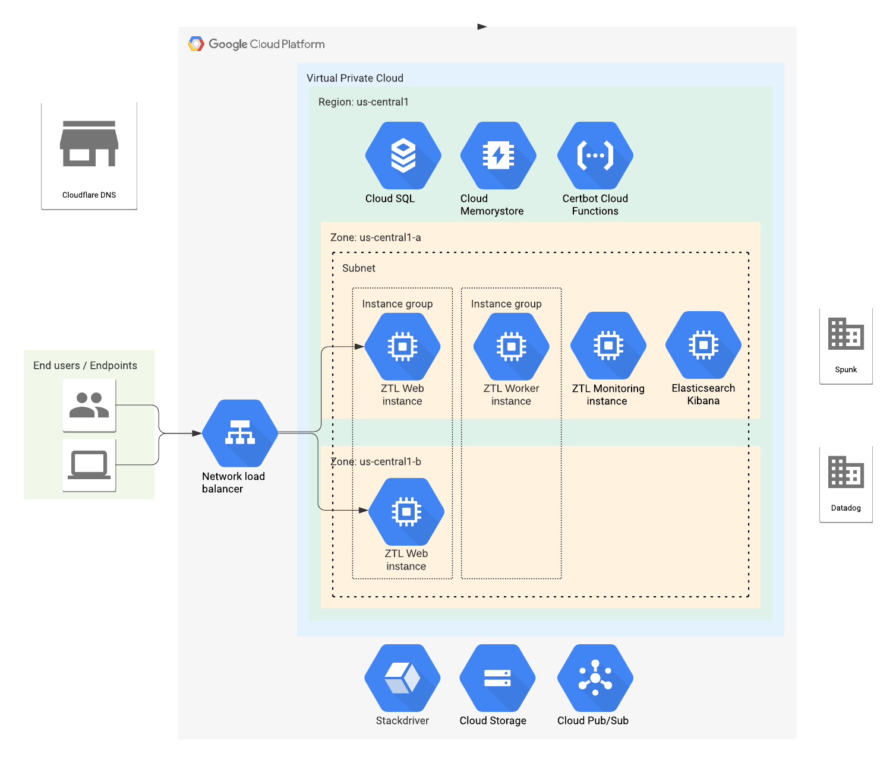

# Terraform modules for Zentral on GCP

See [example](./example).

## Architecture

### VMs

Four different Zentral VMs are used (web, workers, monitoring and ek). The images can be provided by Zentral Pro Services, or they can be built by the customers.

The images are generic, and are automatically configured during VM startup using the `ztl_admin setup` command. This command uses the project metadata and the project secrets to finish configuring the instances (email setup, logging, monitoring agent, zentral configuration, systemd services, …).

On each image, the logs and metrics can be configured to be shipped to datadog using the datadog agent, or to stackdriver and prometheus using the [vector](https://vector.dev) agent.

Optionally it is possible to provide a crowdstrike debian package and `cid` to deploy the crowdstrike agent on the instances.

#### Web instances

Those instances are deployed using the `ztl-web-mig` managed instance group. On each instance, nginx is setup to proxy the requests to gunicorn (python application server) to serve the Zentral web app. Those instances are configured as the targets for the network load balancer.
Other paths are configured using the [nginx auth request](http://nginx.org/en/docs/http/ngx_http_auth_request_module.html) plugin to give access to Kibana on the ek instance, and Grafana and Prometheus on the monitoring instance, using the Zentral authentication and authorization.

#### Workers instances

Those instances are deployed using the `ztl-worker-mig` managed instance group. On each instance, multiple systemd services are configured to enrich, process and ship the events to the configured stores (see [Queues](#Queues) section below).

#### Monitoring instance

The monitoring instance is used to run Grafana and Prometheus. Prometheus is setup using GCP service discovery to scrape the prometheus metrics exposed by the web and worker instances. Grafana is configured with the prometheus and elasticsearch data sources. It can be used for example to fusion the prometheus metrics with the zentral events in custom dashboards.

Two persistent volumes are attached to this instance, one for the grafana configuration and database, one for the prometheus database. This way, the monitoring instance can be upgraded (using a newer image) without loosing the data.

#### EK instance

This instance is used to run a single Elasticsearch + Kibana instance to store the Zentral events.

### Networking

A custom VPC is used with two subnets on 2 different zones. Firewall rules are configured to filter the connections to the different instances.

The instances do not have public IP addresses. A NAT router is used to give them access to the Internet. The IP addresses used by this router can optionaly be managed by Terraform. If not, they are automatically managed by GCP. These addresses are the ones used for example by the Splunk store worker to connect to the Splunk HEC.

A network load balancer is used to balance the traffic coming from the end users and the endpoints to the Zentral web instances, so that nginx could be configured to verify the client certificates (mTLS). The HTTP load balancer available in GCP doesn't provide this functionality (last checked: 2021-09-10).

The TLS certificates and the key can be loaded by Terraform from local files or environment variables, or generated by a cloud function. In both cases, the certificate and the chain are stored in the project metadata. The key is stored as a google secret. Once per day, the `ztl_admin cron` command will fetch the certificate, the chain, and the key, and update the local configurations (nginx and zentral) on the web instances. The cloud function is a python runtime that uses the certbot module to request Let's Encrypt certificates using the ACME protocol, with the [DNS challenge](https://letsencrypt.org/docs/challenge-types/#dns-01-challenge). Only Cloudflare is supported (last checked: 2021-09-10), and credentials with permissions to edit the DNS zone need to be provided.

Some options are available in the zentral terraform module to forward the origin IP address if Cloudflare is used as proxy.

### Storage

#### CloudSQL

[Cloud SQL for PostgreSQL](https://cloud.google.com/sql/docs/postgres/quickstart) is used as the main application database for Zentral. Automatic backups can be configured. The credentials are generated during the terraform setup and made available to the application via the project metadata and secrets.

#### Cloud Storage

Multiple regional buckets are used for this deployment:

 * `ztl-zentral-PROJECT_NAME` is used to store the files generated by the Zentral application (exports, …)
 * `ztl-elastic-PROJECT_NAME` is used to backup the Elasticsearch indices.
 * `ztl-dist-PROJECT_NAME` is a regional bucket used to distribute extra software during the VM setup (Crowdstrike debian package, …).

It is also recommended to setup a bucket to use as [terraform backend](https://www.terraform.io/docs/language/settings/backends/gcs.html).

#### Redis

[Memorystore for Redis](https://cloud.google.com/memorystore/docs/redis/redis-overview) is used both as application cache for Zentral, and as queue for the background processing of some long running tasks (exports, …).

### Queues

This Zentral deployment uses [Google Cloud Pub/Sub](https://cloud.google.com/pubsub/docs/overview) to queue and distribute the events. Only the topics are created by the terraform module. The subscriptions are created if they do not already exist by the zentral [`google_pubsub`](https://github.com/zentralopensource/zentral/blob/ff4996091da22bbb1480be27090ab9a9c3c01382/zentral/core/queues/backends/google_pubsub.py) queue backend. Multiple workers can share the same topic subscription to increase the throughput.

There is also an optional topic to schedule the certbot cloud function.

#### `ztl-raw-event-topic`

Some events generated outside of Zentral need some extra processing (call to an external API for example), and are send to this topic first. A [`preprocess worker`](https://github.com/zentralopensource/zentral/blob/ff4996091da22bbb1480be27090ab9a9c3c01382/zentral/core/queues/backends/google_pubsub.py#L43) will read the events from a `raw-events-subscription` attached to this topic, build zentral events, and post them to the `ztl-events-topic`.

#### `ztl-events-topic`

This is the topic receiving all the Zentral events, either directly or preprocessed from the `ztl-raw-event-topic`. An [`enrich worker`](https://github.com/zentralopensource/zentral/blob/ff4996091da22bbb1480be27090ab9a9c3c01382/zentral/core/queues/backends/google_pubsub.py#L117) will read the events from a `events-subscription` attached to this topic, add extra information (inventory, severity, …) and post them to the `ztl-enriched-events-topic`.

#### `ztl-enriched-events-topic`

All Zentral events are posted to this topic, with the extra information they received during the enrichment step above. Multiple subscriptions are attached to this topic:

 * `*-store-enriched-events-subscription` for each of the configured event stores (`*` is replaced by the name of the store in the Zentral configuration). A corresponding [`store worker *`](https://github.com/zentralopensource/zentral/blob/ff4996091da22bbb1480be27090ab9a9c3c01382/zentral/core/queues/backends/google_pubsub.py#L224) will read one or many of the enriched events, and try to store them.

 * `process-enriched-events-subscription` where the events are queued for the [`process worker`](https://github.com/zentralopensource/zentral/blob/ff4996091da22bbb1480be27090ab9a9c3c01382/zentral/core/queues/backends/google_pubsub.py#L178). This worker is used to trigger the probe actions on the matching events.

#### `ztl-certbot`

Used by the [google cloud scheduler](https://cloud.google.com/scheduler/docs/quickstart) to trigger the certbot cloud function. Only created if the certbot cloud function is activated.

## Deployment

### Manual tasks!!!

Sadly, to enable some APIs on the project, APIs are required! Make sure the *Service Usage API* and *Cloud Resource Manager API* are enabled on the project before attempting a deployment.

### Permissions / Roles

#### In the GCP project

GCP predefined roles covering the necessary permissions to run the TF setup:

|TF Resources|Description|GCP Predefined roles|Ref.|
|---|---|---|---|
|`google_project_service`|To enable the required APIs|`roles/serviceusage.serviceUsageAdmin`|[access](https://cloud.google.com/service-usage/docs/access-control#roles)|
|`google_project_iam_binding` `google_project_iam_custom_role` `google_project_iam_member` `google_service_account`|To manage the custom service accounts and policies|`roles/iam.roleAdmin` `roles/iam.serviceAccountAdmin` `roles/iam.serviceAccountUser` `roles/resourcemanager.projectIamAdmin`||
|`google_compute_address` `google_compute_subnetwork` `google_compute_disk` `google_compute_firewall` `google_compute_forwarding_rule` `google_compute_global_address` `google_compute_http_health_check` `google_compute_instance` `google_compute_instance_template` `google_compute_network` `google_compute_project_metadata_item` `google_compute_region_instance_group_manager` `google_compute_router` `google_compute_router_nat` `google_compute_target_pool`||`roles/compute.admin`|[roles](https://cloud.google.com/compute/docs/access/iam#predefinedroles)|
|`google_service_networking_connection`|Private networking peering|`roles/servicenetworking.networksAdmin`||
|`google_pubsub_topic`||`roles/pubsub.admin`|[access](https://cloud.google.com/pubsub/docs/access-control)|
|`google_redis_instance`||`roles/redis.admin`|[access](https://cloud.google.com/memorystore/docs/redis/access-control)|
|`google_secret_manager_secret` `google_secret_manager_secret_iam_member` `google_secret_manager_secret_version`||`roles/secretmanager.admin`|[access](https://cloud.google.com/secret-manager/docs/access-control)|
|`google_sql_database` `google_sql_database_instance` `google_sql_user`||`roles/cloudsql.admin`|[access](https://cloud.google.com/sql/docs/postgres/project-access-control)|
|`google_storage_bucket` `google_storage_bucket_iam_member` and the TF state backend||`roles/storage.admin`|[roles](https://cloud.google.com/storage/docs/access-control/iam-roles)|
|**ONLY IF ELASTICSEARCH INSTANCE:**||||
|`google_service_account_key`|To manage the SA key for the ES backups|`roles/iam.serviceAccountKeyAdmin`|[access](https://cloud.google.com/iam/docs/understanding-roles#iam.serviceAccountKeyAdmin)|
|**ONLY IF CLOUD FUNCTION:**||||
|`google_app_engine_application`||`roles/appengine.appAdmin` `roles/appengine.appCreator`|[access](https://cloud.google.com/appengine/docs/standard/go/roles#predefined_roles)|
|`google_cloud_scheduler_job`||`roles/cloudScheduler.admin`||
|`google_cloudfunctions_function`||`roles/cloudfunctions.developer` *(IAM permissions already covered)*|[roles](https://cloud.google.com/functions/docs/reference/iam/roles)|
|**ONLY IF MONITORING:**||||
|`google_monitoring_alert_policy`||`roles/monitoring.alertPolicyEditor`|
|`google_monitoring_notification_channel`||`roles/monitoring.notificationChannelEditor`|
|`google_monitoring_uptime_check_config`||`roles/monitoring.uptimeCheckConfigEditor`|

#### To access the pre-built Zentral images

In order to access the pre-build Zentral images, communicate the list of principals (users, service account) used to run terraform to Zentral Pro Services, and we will grant them access. For more information, see [zentral-images](https://github.com/zentralpro/zentral-images/tree/master/config/gcp) repository.